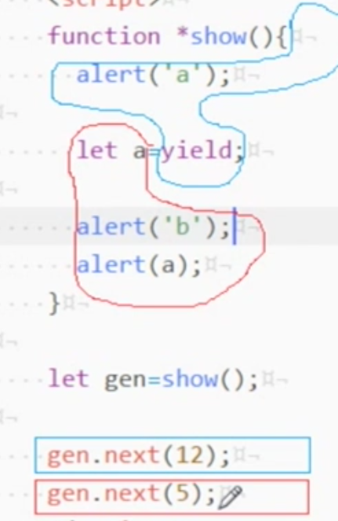
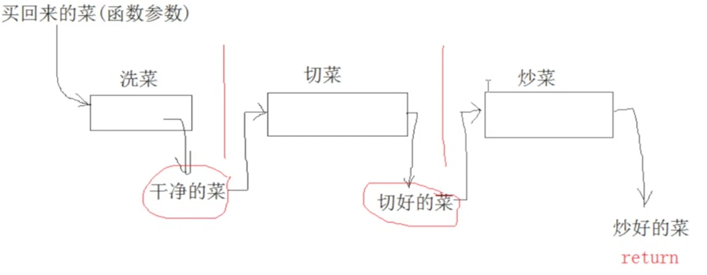

### generator
---
#### generator
- 特殊的函数,执行中间可以暂停、
- 注意.不能使用箭头函数
```JavaScript

    function *show(){
        alert('a');

        yield;

        alert('b');
    }   

    let genObj = show();

    genObj.next();
    //a
    genObj.next();
    //b

    // 实现原理将一个函数,拆分成多个子函数分步执行

    //伪代码
    function *show(){
        代码----
        yield  ajax代码
        代码----
    }

```
#### yield
- 可以传参,也可以有返回

```javaScript
    //传参
    function *show(num1,num2){
        
        alert(num1);

        let a = yield;

        alert(num2);

        alert(a)

    }

    let genObj = show();

    genObj.next(15);
    
    genObj.next(5);

    //输出 a b 5

```
图解原理：



```javaScript
    //返回
    function *show(){
        
        alert('a');

        yield 12;

        alert('b');

        return 55;

    }

    let genObj = show();

    let result1 = genObj.next();
    
    let result2 = genObj.next();

    //result1返回值格式 {value :12,done:false}
    //result2返回值格式 {value :undefined,done:true},没有返回值的时候
    //result2返回值格式 {value :55,done:true},有返回值的时候

    //输出 a b

    //伪代码
    function *炒菜(菜市场买回来){

        洗菜->洗好的菜

        let 干净的菜 = yield 洗好的菜;

        干净的菜->切->丝

        let 切好的菜 = yield 干净的菜;

        切好的菜->炒->熟的菜

        return 熟的菜
    }

    //如上图 炒菜的示意图
```