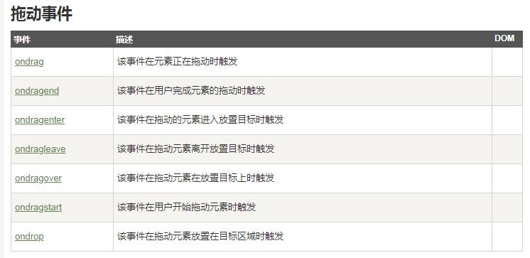
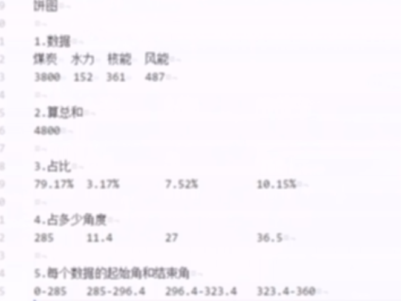
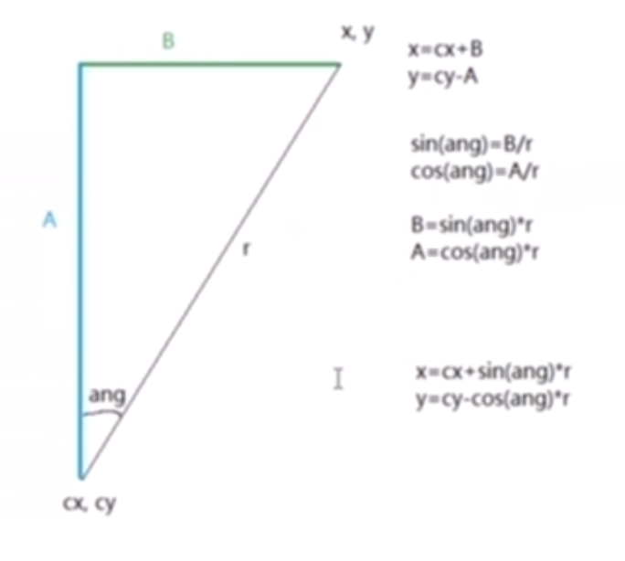

### HTML5-2
---
- geolocation
- video audio
- localStorage 废弃
- WebSql/IndexedDB 废弃
- WebWorker 多线程
- 文件操作,拖拽
- manifest 废弃
- canvas
#### 文件操作,拖拽
- 常用拖拽事件
- 文件操作

##### 常用拖拽事件


##### 常用拖拽事件 demo
```JavaScript
<!DOCTYPE html>
<html>

<head>
    <meta charset="utf-8" />
    <meta http-equiv="X-UA-Compatible" content="IE=edge">
    <title>拖拽文件</title>

    <style>
        #div1 {

            width: 400px;
            height: 200px;
            background: #cccccc;
            border: 1px solid black;
            margin: 50px auto 0;
            text-align: center;
            line-height: 200px;
        }
    </style>


    <script type="text/javascript">

        window.onload = function () {

            let oDiv = document.getElementById("div1")

            oDiv.addEventListener('dragenter', function () {
                oDiv.innerHTML = '释放鼠标'
            }, false)

            oDiv.addEventListener('dragleave', function () {
                oDiv.innerHTML = '将文件拖拽至此区域'
            }, false)

            oDiv.addEventListener('dragover', function (ev) {
                ev.preventDefault(); //阻住浏览器默认事件

                console.log('拖住文件悬停在区域中')
            }, false)

            oDiv.addEventListener('drop', function (ev) {
                
                ev.preventDefault();
        
                console.log(ev.dataTransfer.files)

                console.log('拖住文件悬停在区域中,且松手') 

            }, false);
        }

    </script>
</head>

<body>

    <div id="div1">将文件拖拽至此区域</div>

</body>

</html>
```
[常用拖拽事件][拖拽](../example/html5/拖拽文件.html)


##### 拖拽 读取文件

```JavaScript

 oDiv.addEventListener('drop', function (ev) {
                
                ev.preventDefault();
                
                //数组
                let ofiles = ev.dataTransfer.files;

                let ofile = ofiles[0];
        
                //读取文件

                let reader = new FileReader();


                reader.onload = function(){
                    alert('读取成功')
                    alert(reader.result)
                }

                reader.onerror = function(){
                    alert('读取失败')
                }
                
                //读取文本文件                                                   文本
                //reader.readAsText(ofile);
                
                
                //读取图片,转成base64                                             图片
                //reader.readAsDataURL(ofile)
                
                //读取图片,转到数组缓冲区,原始二进制数据   文本                     不实用
                //reader.readAsArrayBuffer(ofile)

                //读取图片,转到二进制字符串,不是原始二进制数据,更利于传输  文本形式   上传
                //reader.readAsBinaryString(ofile)


            }, false);

```
[拖拽文件][读取文件](../example/html5/拖拽文件读取文件.html)
#### canvas
- 什么都可以实现
- 性能特别高

##### 常用操作
- getContext('2d') 图形上下文 2d
- 路径操作
    
    - 路径构化路径
    
        - moveTo 落笔
        - lineTo 连线
        - lineWidth 线宽度
    - 描边 填充

        - stroke 描边
        - strokeStyle 描边颜色
        - fill 填充
        - fillStyle 填充颜色

            - [范例1][canvas1](../example/html5/canvas1.html)
        - beginPath 清除之前所有路径
        - closePath 闭合路径
            - [范例2][canvas2](../example/html5/canvas2.html)
    - 文字
        
        - strokeText 描边字体 空心字
        - fillText 填充字体  实心字
        - font 字体样式

###### 形状
- 矩形
    - 参数
       
        - rect(100,100,400,300)  参数说 前两个参数 落笔地点 ，后两个参数 长宽
        - strokeRect
        - fillRoct 
    - 路径版
       
        - rect
        - clearRect 擦除给定矩形里的数据,实现动画
        - [矩形擦除][canvas8](../example/html5/canvas8.html) 
    - 直接出图
      
        - strokeRect
        - fillRoct 
    - [矩形][canvas4](../example/html5/canvas4.html)
- 弧形

    - arc(cx,cy,r,startAng,endAng,是否逆时针)   cx cy 确定圆心, r 半径,startAng 起始角度 ,      endAng结束角度,是否逆时针
    - [弧形][canvas5](../example/html5/canvas5.html)
##### 变换，图片

- 旋转
    
    - rotate() 旋转图像,整个画布都旋转
    - translate() 重新映射画布0.0的位置
    - save() 保存canvas的状态
    - restart() 恢复状态

        -  [旋转][canvas9](../example/html5/canvas9.html)

- 图片
    
    - drawImage

        -  [图片][canvas10](../example/html5/canvas10.html)


##### 实例

###### 画图
[画图][canvas3](../example/html5/canvas3.html)

###### 饼图


[饼图][canvas6](../example/html5/canvas6.html)
[饼图][canvas7](../example/html5/canvas7.html)
