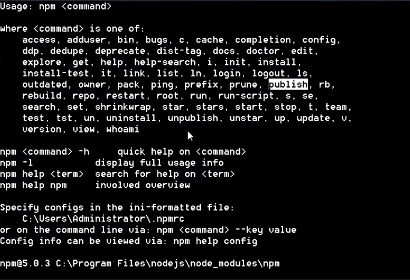
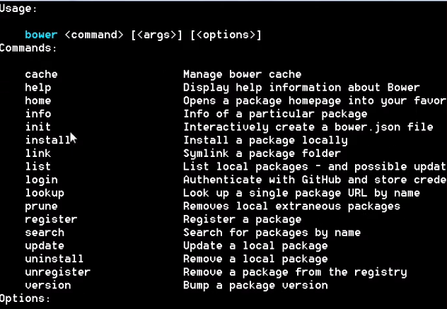

### node
---
- 操作数据,提供接口    35%
- 工具 - webpack,爬虫 65%
#### 常用命令
    1. 直接运行javaScript
        cmd下使用node 进入交互模式,可以进行类似于chmore的console的交互,缺点不能进行多行。
    
    2. 运行.js文件
        进入到.js文件所在目录,通过node xx.js 进行运行。

    3. node -v
        node版本查看

    4. node升级
        npm install -g n

#### npm(后台包管理器)
- 包管理器(下载依赖包依赖库,自动解决依赖关系),类似于python的pip,或者linux的yum/apt-get
    
    - 自动下载
    - 解决依赖
- 命令列表

##### npm install -g
    1.安装依赖包
        npm install -g Jquery    

    2.-g 参数
        -g参数代表全局安装,在计算机任意位置都可使用。

    3.下载目录
         依赖包在安装node-modules安装目录下。

    4.安装cnpm源  (由于node源在国外,下载比较慢,可以通过替换淘宝源提升下载速度。)
        $ npm install -g cnpm --registry=https://registry.npm.taobao.org
        
    5.版本区分
        npm i -g phonegap@6.5.2
        通过@进行区分版本

#### bower(前台包管理器)
- 安装bootStrap,或者vue 等前端包 
- 命令列表

##### 安装bower

    1.安装bower
        cnpm install -g bower

    2.下载目录
        依赖包在安装bower-components安装目录下。

##### nodejs的基础使用
- 特点

    - 性能高,java的86倍
    - 跟前台配合开发方便
    - 适合前端人员入门
- java与node对比
    
    - java适合做大型项目,企业开发
    - node只适合写小型项目,工具型项目,中间层语言
- 手写http服务器实战
[手写服务器nodejs实现](../example/node/server.js)