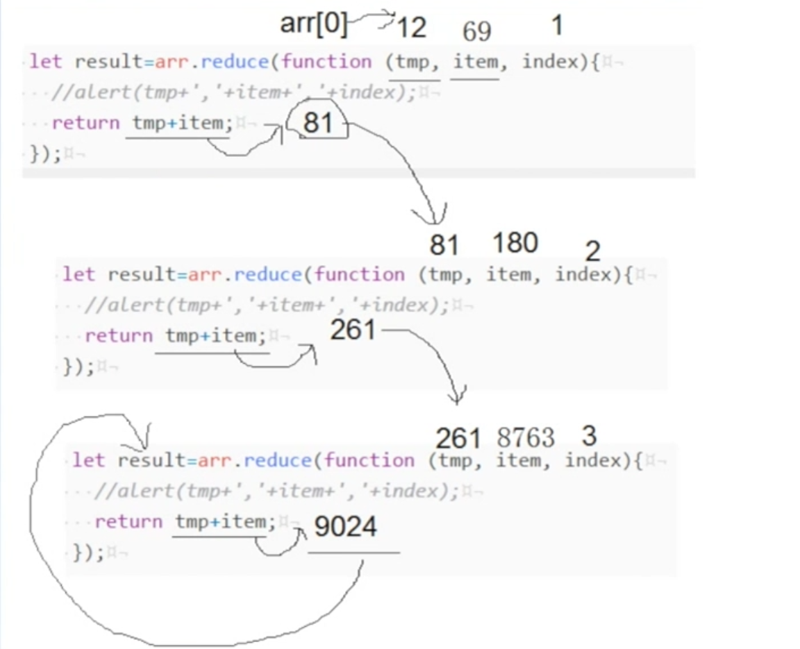

###数组
---
####  解构赋值
    
    1. 左右两侧结构必须一样
    2. 右边必须是个符合定义的解构
    3. 申明和赋值不能分开（必须在一句中完成）

```JavaScript
    原始赋值:
    let arr = [1,2,3]
    let a = arr[0]
    let a = arr[1]
    let a = arr[2]

    解构赋值:
    let[a,b,c]=[1,2,3]

    json解构赋值:
    let {a,c,b}={a:1,c:2,b:3}    

    多结构赋值:
    let [{a,b},[n1,n2,n3],num,str]=[{a:1,b:2},[12,5,8],8,'cxzcv']
    console.log(a,b,n1,n2,n3,num,str)

    粒度可以自己控制:
     let [json,arr,num,str]=[{a:1,b:2},[12,5,8],8,'cxzcv']
     console.log(json,arr,n1,n2,n3,num,str)

    错误写法：
    1.右边不是一个符合js规范的结构
        let {a,b}={12,5}
    
    2.声明和赋值不能分开
        let [a,b]
        [a,b]=[1,2]
```
##### map
- 映射,即一个对一值,给你5个值你反给我5个值
```JavaScript
    例:
    [12,58,99,86,45,91]
    [不及格,不及格,及格,及格,不及格,及格]

    例：
    [45,57,135]
    [{
        name:'blue',
        level:'0',
        role:0
    },{
        name:'zhangsan',
        level:'99',
        role:3
    },{
        name:'red',
        level:'0',
        role:0
    }]

    代码例:
    let arr=[12,5,8]

    var result = arr.map(function(item){
        return item*2;
    });

    简写代码:
    [

    var result = arr.map(item=>return item*2)

    ]
    console.log(result);

    输出 24,10,16

    代码例2：

    let score=[19,85,99,25,90]

    let result = score.map(item=>item>60?'及格':'不及格')

```
##### reduce
- 汇总,一堆值返回一个值
    - 结算总值
    - 计算平均值
    
    原理
    

```JavaScript

    //例：计算总数
    let arr=[12,69,180,8763]

    // temp = 中间结果
    // item = 传入值
    // index = 传入值得索引

    let result = arr.reduce(function(temp,item,index)}{
        return temp+item;
    });

    //例：计算平均数
    let result = arr.reduce(function(temp,item,index)}{
       if(index!=this.arr.length){
           return temp+item;
       }else{
           return (temp+item)/this.arr.length;
       }
    });

```

##### filter 
- 过滤器,过滤元素
```JavaScript
    //例1：
    let arr = [12,5,8,99,27,36,75]

    let result = arr.filter(item=>{
        if(item%3==0){
            return true;
        }else{
            return false
        }
    })
    

    //简写

    let result = arr.filter(item=>item%3==0)


    //例2：
    let arr = [
        {
            title:'男士衬衫',
            price:75
        },{
            title:'女士包',
            price:50000
        },{
            title:'女士鞋',
            price:20000
        }  ]
    arr.filter(item=>item.price>1000)
```
##### forEach
- 迭代
```JavaScript
    let arr=[1,2,3]
    arr.forEech(item=>{
        alter(item)
    })

    arr.forEech((item,index)=>{
        alter(item+''+index)
    })

```
